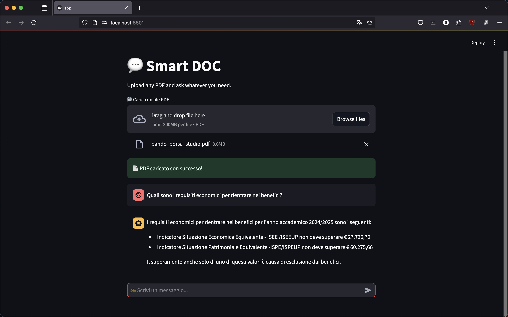

Smart Doc

In questo progetto si definisce un semplice esempio di sistema RAG (Retrieval-Augmented Generation) che integra il recupero di informazioni da documenti con la generazione di risposte basate su GPT-4 di OpenAI.

Tecnologie Utilizzate:

-Streamlit: Per la creazione di un'interfaccia utente interattiva e user-friendly.

-FastAPI e Uvicorn: Per la definizione e gestione delle API REST e l'ASGI server.

-OpenAI GPT-4: Il modello LLM che genera le risposte basate sulle query degli utenti.

-LangChain: Per la gestione del contesto conversazionale e la memoria, integrato tramite:
langchain-openai, per interfacciarsi con OpenAI all'interno di LangChain. langchain-community, per la gestione dei documenti e della memoria.

-Pinecone: Vector database per l'elaborazione e l'indicizzazione dei documenti, consentendo ricerche rapide e mirate.

